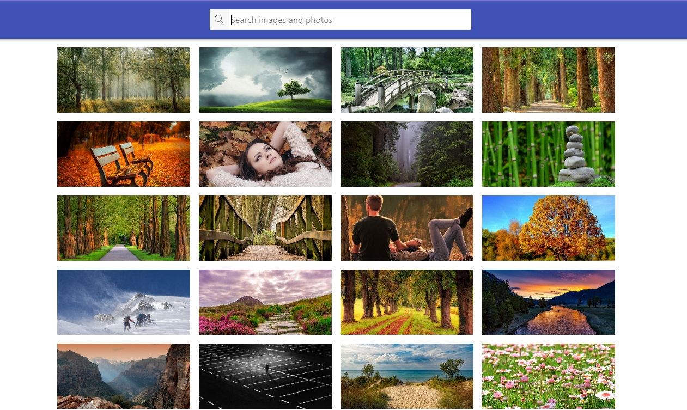
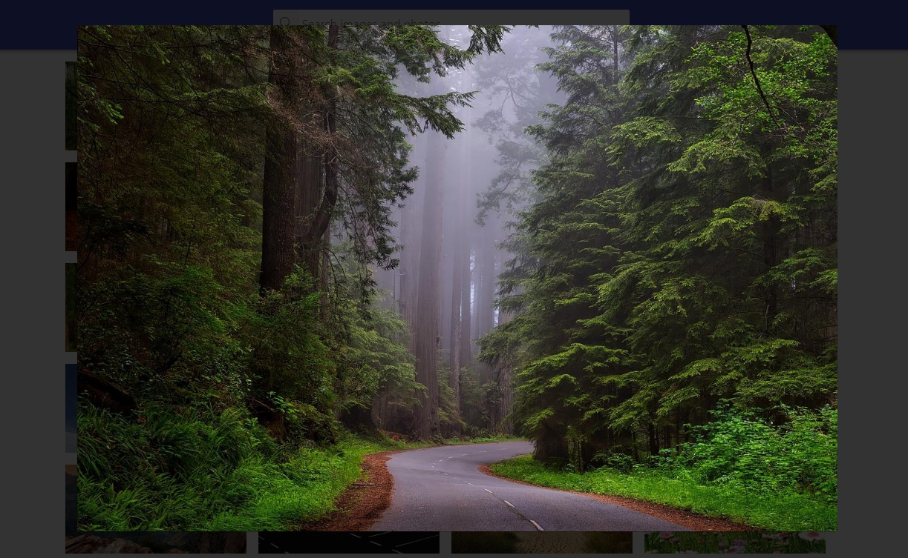

**Read in other languages: [Русский](README.md).**

# React homework template

Цей проект був створений за допомогою
[Create React App](https://github.com/facebook/create-react-app). Для знайомства
та налаштування додаткових можливостей
[зверніться до документації](https://facebook.github.io/create-react-app/docs/getting-started).

## Images

Програма пошуку зображень за ключовим словом.Ппопередній перегляд програми
дивись за
[посиланням](https://drive.google.com/file/d/1oXCGyiq4uKwW0zzraZLKk4lh3voBlBzZ/view).
Demo: https://aiilui19.github.io/goit-react-hw-04-images/

## Demo/Preview

Modal window

